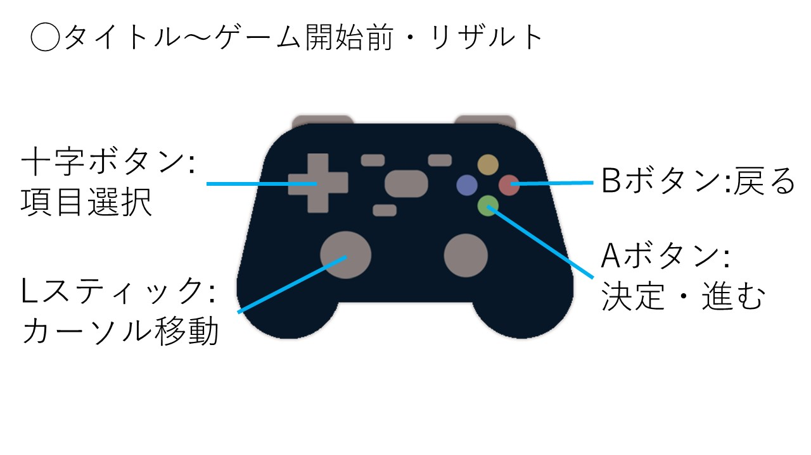
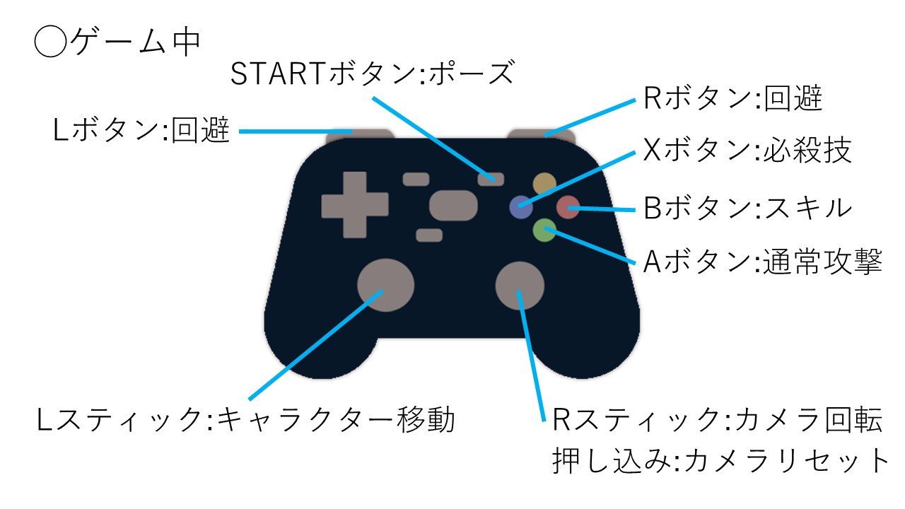

#  **「SWORD ARENA」ポートフォリオ** <!-- omit in toc -->
### 河原電子ビジネス専門学校ゲームクリエイター科　2年 
### 氏名：橘　一生
---
# 目次 <!-- omit in toc -->
- [1. 作品概要](#1-作品概要)
- [2. 担当ソースコード](#2-担当ソースコード)
- [3. 改造したエンジンコード](#3-改造したエンジンコード)
- [4. 操作説明](#4-操作説明)
- [5. 技術紹介](#5-技術紹介)
  - [5.1. デプスシャドウ](#51-デプスシャドウ)
  - [5.2. 川瀬式ブルームフィルター](#52-川瀬式ブルームフィルター)

---
# 1. 作品概要
* タイトル 
  * **SWORD ARENA**

* ゲーム内容
  * プレイヤー1人と3体のAIが、それぞれ敵となりフィールド上で戦います
  * 3分間で獲得したポイント数を競い、最も多くのポイントを獲得した者が勝利となります

* 学校
  * 河原電子ビジネス専門学校

* 制作人数
  * 4人

* 制作期間
  * 2023年2月～2023年5月(日本ゲーム大賞2023「アマチュア部門」用期間)
  * 2023年6月～2023年7月(機能追加・リファクタリング用期間)

* ゲームジャンル
  * 対戦アクションゲーム

* プレイ人数
  * 1人

* 対応ハード
  * PC
    * Xbox 360 コントローラー

* 使用言語
  * C++
  * HLSL

* 使用ツール
  * プログラム(C++)
    * Visual Studio 2022
  * プログラム(HLSL)
    * VS Code
  * 3Dソフト
    * 3ds Max
  * エフェクト
    * Effekseer
  * 画像
    * Adobe Photoshop 2023
  * バージョン管理
    * GitHub
    * Fork(GitGUIクライアント)
  * タスク管理
    * Notion
  * 連絡
    * Slack

* 開発環境
  * エンジン
    * 学校内製の簡易エンジン(DirectX12)
  * OS
    * Windows11

# 2. 担当ソースコード

  cppファイル,hファイル
  

* Bloom.cpp
* Bloom.h
* CameraCollisionSolver.cpp
* CameraCollisionSolver.h
* CollisionObject.cpp
* CollisionObject.h
* FontRender.cpp
* FontRender.h
* Level3DRender.cpp
* Level3DRender.h
* Light.cpp
* Light.h
* ModelRender.cpp
* ModelRender.h
* PostEffect.cpp
* PostEffect.h
* RenderingEngine.cpp
* RenderingEngine.h
* Shadow.cpp
* Shadow.h
* SkyCube.cpp
* SkyCube.h
* SpriteRender.cpp
* SpriteRender.h
* Result.cpp
* Result.h

  fxファイル
  

* model.fx
* ShadowReciever.fx
* skyCubeMap.fx
* sprite.fx(一部)
  * 定数バッファ"SpriteCB"の追加
  * CalcGrayScale関数の追加
* gaussianBlur.fx
* postEffect.fx

# 3. 改造したエンジンコード

  改造したエンジンコード
  

* a

# 4. 操作説明
 
 

# 5. 技術紹介
## 5.1. デプスシャドウ

## 5.2. 川瀬式ブルームフィルター
