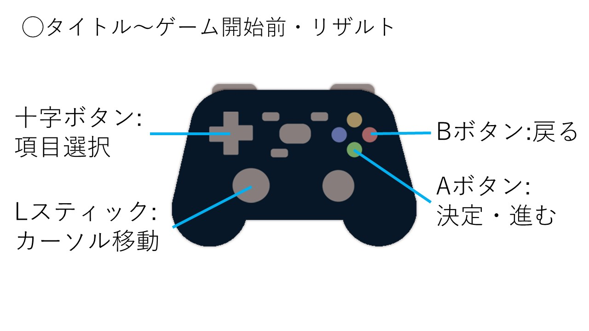
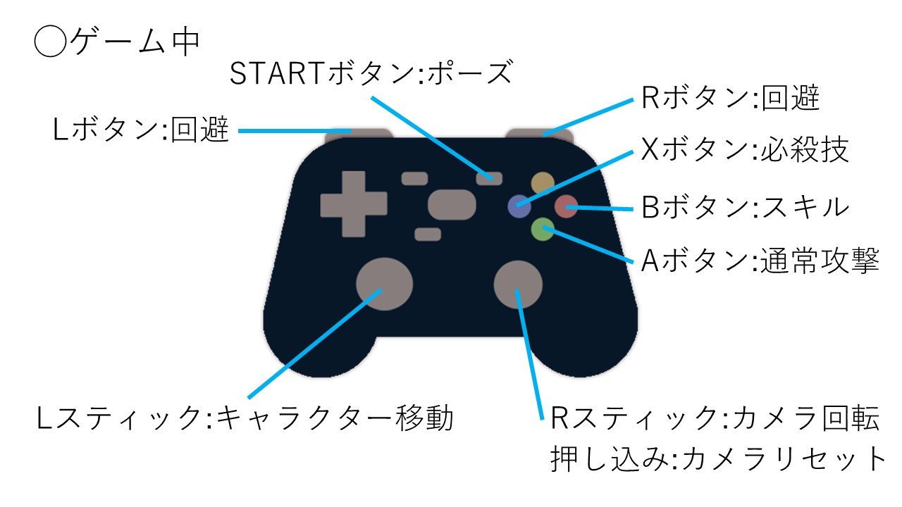
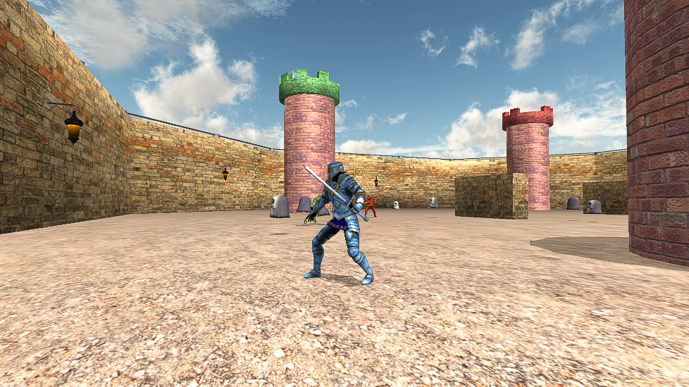
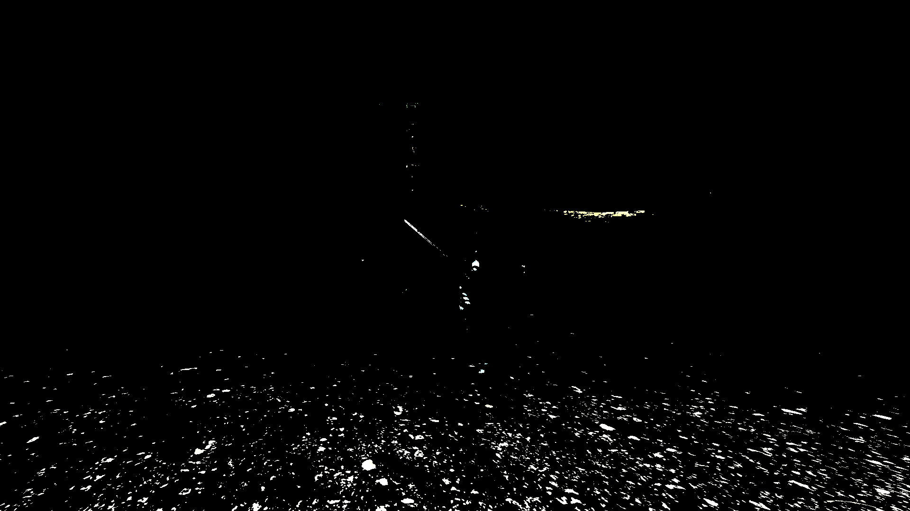
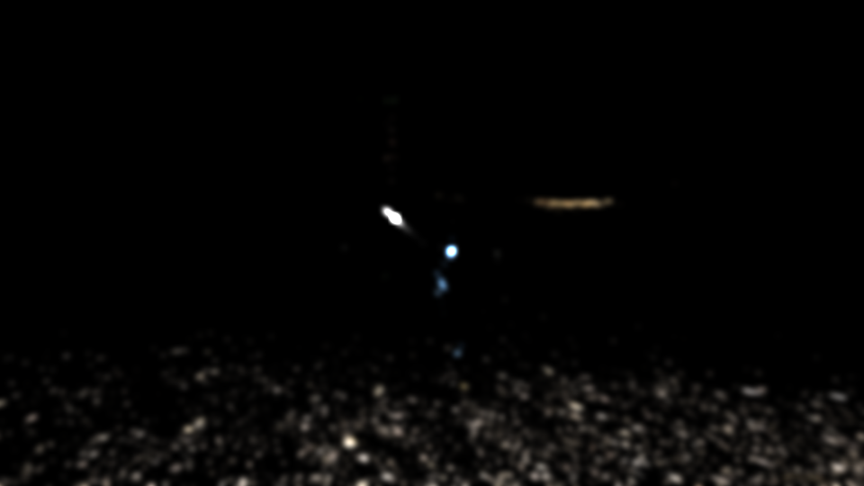
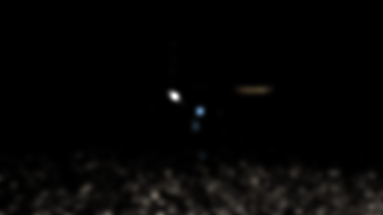
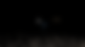

#  **「SWORD ARENA」ポートフォリオ** <!-- omit in toc -->
### 河原電子ビジネス専門学校ゲームクリエイター科　2年<br>　<!-- omit in toc -->
### 氏名：橘　一生　<!-- omit in toc -->
---
<!-- omit in toc -->
# 目次
- [1. 作品概要](#1-作品概要)
- [2. 担当ソースコード](#2-担当ソースコード)
- [3. 操作説明](#3-操作説明)
- [4. プレイヤー](#4-プレイヤー)
  - [4.1. 通常攻撃](#41-通常攻撃)
- [5. 敵CPUについて](#5-敵cpuについて)
- [6. 技術紹介(グラフィックス)](#6-技術紹介グラフィックス)
  - [6.1. デプスシャドウ](#61-デプスシャドウ)
    - [6.1.1. シャドウマップを作成する](#611-シャドウマップを作成する)
    - [6.1.2. ライトビュースクリーン空間でのZ値を計算する](#612-ライトビュースクリーン空間でのz値を計算する)
    - [6.1.3. シャドウマップに書き込まれているZ値と比較する](#613-シャドウマップに書き込まれているz値と比較する)
  - [6.2. 川瀬式ブルームフィルター](#62-川瀬式ブルームフィルター)
    - [6.2.1. モデルを描画する](#621-モデルを描画する)
    - [6.2.2. 輝度抽出をする](#622-輝度抽出をする)
    - [6.2.3. 輝度抽出したテクスチャにガウシアンブラーをかけボケ画像を作成](#623-輝度抽出したテクスチャにガウシアンブラーをかけボケ画像を作成)
    - [6.2.4. 3で作成したボケ画像にさらにガウシアンブラーをかけボケ画像を作成](#624-3で作成したボケ画像にさらにガウシアンブラーをかけボケ画像を作成)
    - [6.2.5. 4で作成したボケ画像にさらにガウシアンブラーをかけボケ画像を作成](#625-4で作成したボケ画像にさらにガウシアンブラーをかけボケ画像を作成)
    - [6.2.6. 5で作成したボケ画像にさらにガウシアンブラーをかけボケ画像を作成](#626-5で作成したボケ画像にさらにガウシアンブラーをかけボケ画像を作成)
    - [6.2.7. 4枚のボケ画像の合成し、シーンに加算合成する](#627-4枚のボケ画像の合成しシーンに加算合成する)

---
# 1. 作品概要
* タイトル<br>
  * **SWORD ARENA**

* ゲーム内容
  * プレイヤー剣士が、AI剣士3名とアリーナ内で戦い3分間でポイントの多さを競うアクションゲーム
* ルール
  * 時間は3分間
  * フィールド上にいるエネミー(ゴーストとうさぎ)を倒すと経験値を獲得し、Lvが上がる
  * レベルが上がると、ステータスが上昇
  * Lvが4以上になると必殺技が使用可能
  * 必殺技を使用するとLvは1になる
  * 勝利条件は、ポイントの多寡で決まる
  * ポイントは自分以外の剣士を倒すと獲得できる

* 学校
  * 河原電子ビジネス専門学校

* 制作人数
  * 4人

* 制作期間
  * 2023年2月～2023年5月(日本ゲーム大賞2023「アマチュア部門」用期間)
  * 2023年6月～2023年7月(機能追加・リファクタリング用期間)

* ゲームジャンル
  * 3Dアクションゲーム

* プレイ人数
  * 1人

* 対応ハード
  * PC
    * Xbox 360 コントローラー

* 使用言語
  * C++
  * HLSL

* 使用ツール
  * プログラム(C++)
    * Visual Studio 2022
  * プログラム(HLSL)
    * VS Code
  * 3Dソフト
    * 3ds Max
  * エフェクト
    * Effekseer
  * 画像
    * Adobe Photoshop 2023
  * バージョン管理
    * Git
    * GitHub
    * Fork(GitGUIクライアント)
  * タスク管理
    * Notion
  * 連絡
    * Slack

* 開発環境
  * エンジン
    * 学校内製の簡易エンジン(DirectX12)
  * OS
    * Windows11

<div style="text-align: right;">

[目次へ](#目次)
</div>

# 2. 担当ソースコード
<details><summary>
  cppファイル,hファイル
  </summary>

* Bloom.cpp
* Bloom.h
* CameraCollisionSolver.cpp
* CameraCollisionSolver.h
* CollisionObject.cpp
* CollisionObject.h
* FontRender.cpp
* FontRender.h
* Level3DRender.cpp
* Level3DRender.h
* Light.cpp
* Light.h
* ModelRender.cpp
* ModelRender.h
* PostEffect.cpp
* PostEffect.h
* RenderingEngine.cpp
* RenderingEngine.h
* Shadow.cpp
* Shadow.h
* SkyCube.cpp
* SkyCube.h
* SpriteRender.cpp
* SpriteRender.h
* Result.cpp
* Result.h

</details>

<details><summary>
  fxファイル
  </summary>

* model.fx
* ShadowReciever.fx
* skyCubeMap.fx
* sprite.fx(一部)
  * 定数バッファ"SpriteCB"の追加
  * CalcGrayScale関数の追加
* gaussianBlur.fx
* postEffect.fx

</details>
<!--
# 3. 改造したエンジンコード
<details><summary>
  改造したエンジンコード
  </summary>
* a
</details>
-->

<div style="text-align: right;">

[目次へ](#目次)
</div>

# 3. 操作説明
<br>
<br>

<div style="text-align: right;">

[目次へ](#目次)
</div>

# 4. プレイヤー
プレイヤーについて紹介していきます。
## 4.1. 通常攻撃
Aボタンを押すことで発動できます。最大3段の攻撃を行うことができます。

[](https://youtu.be/5uqOoY6OSqI)

# 5. 敵CPUについて

# 6. 技術紹介(グラフィックス)
## 6.1. デプスシャドウ
デプスシャドウとは、投影シャドウの考え方を発展させたものです。
投影シャドウと異なる点は「シャドウマップに書き込む値は、グレースケールではなく、ライトスクリーン空間での深度値(デプス)である。」という点です。<br>
実装手順は以下の通りです。

1. シャドウマップを作成する
2. ライトビュースクリーン空間でのZ値を計算する
3. シャドウマップに書き込まれているZ値と比較する

### 6.1.1. シャドウマップを作成する
Z値を書き込んでシャドウマップを作成します。
```HLSL
/// <summary>
/// シャドウマップ描画用のピクセルシェーダー
/// </summary>
float4 PSShadowMapMain(SPSIn psIn) : SV_Target0
{
    //シャドウマップにZ値を書き込む
    return float4(psIn.pos.z, psIn.pos.z, psIn.pos.z, 1.0f);
}
```
上記のピクセルシェーダーを実行するとこのようなシャドウマップが作成されます。


---

### 6.1.2. ライトビュースクリーン空間でのZ値を計算する
影を受けるモデルのライトビュースクリーン空間でZ値を計算します。
```HLSL
float zInLVP = psIn.posInLVP.z / psIn.posInLVP.w;
```

---

### 6.1.3. シャドウマップに書き込まれているZ値と比較する
シャドウマップに書き込まれているZ値と2.で求めたライトビュースクリーン空間でのZ値を比較して、遮蔽されていれば影を落とします。
```HLSL
// シャドウマップに描き込まれているZ値と比較する
// UV座標を使って、シャドウマップから深度値をサンプリング
float zInShadowMap = g_shadowMap.Sample(g_sampler,shadowMapUV).r;
if(zInLVP > zInShadowMap)
{
  // 遮蔽されている
  albedoColor.xyz *= 0.7f;
}
```
↓実際のゲーム画面<br>


<div style="text-align: right;">

[目次へ](#目次)
</div>

## 6.2. 川瀬式ブルームフィルター
ポストエフェクトの１つであるブルームを川瀬正樹氏が発表した川瀬式ブルームフィルターを使用して実装しました。<br>
普通のブルームはレンダリング後の画面から輝度抽出し、明るい部分にガウシアンブラーをかけて、元の画面に加算合成するものです。しかし、この方法だと強い光を当てた時、きれいに光が広がりません。<br>
一方、川瀬式ブルームフィルターはダウンサンプリングをしながら、複数回ガウシアンブラーをかけます。それらのテクスチャを同解像度に拡大合成して、あふれテクスチャを生成し、元の画面に加算合成しています。これにより、きれいに光があふれるようになります。<br>

実装手順は以下の通りです。

1. モデルを描画する
2. 輝度抽出をする
3. 輝度抽出したテクスチャにガウシアンブラーをかけボケ画像を作成
4. 3で作成したボケ画像にさらにガウシアンブラーをかけボケ画像を作成
5. 4で作成したボケ画像にさらにガウシアンブラーをかけボケ画像を作成
6. 5で作成したボケ画像にさらにガウシアンブラーをかけボケ画像を作成
7. 4枚のボケ画像の合成し、シーンに加算合成する

>ブルーム効果がわかりやすいようにライトの明るさを上げています。
   
---

### 6.2.1. モデルを描画する
ポストエフェクトはレンダリングした絵に対し、レタッチを行ってエフェクトを追加していく処理のことです。
<br>そのため、まず全てのモデルを描画していきます。



---

### 6.2.2. 輝度抽出をする
レンダリング後の画面から輝度抽出をします。



---

### 6.2.3. 輝度抽出したテクスチャにガウシアンブラーをかけボケ画像を作成
輝度抽出したテクスチャをダウンサンプリングして、ガウシアンブラーをかけます。<br>
解像度を1920x1080 → 960x540 にダウンサンプリングしています。<br>
ダウンサンプリングをすることで頂点シェーダーの実行回数が減り処理速度が向上します。<br>



---

### 6.2.4. 3で作成したボケ画像にさらにガウシアンブラーをかけボケ画像を作成
3で作成したボケ画像を960x540 → 480x270にダウンサンプリングしてさらにガウシアンブラーをかけます。<br>



---

### 6.2.5. 4で作成したボケ画像にさらにガウシアンブラーをかけボケ画像を作成
4で作成したボケ画像を480x270 → 240x135にダウンサンプリングしてさらにガウシアンブラーをかけます。<br>


---

### 6.2.6. 5で作成したボケ画像にさらにガウシアンブラーをかけボケ画像を作成
5で作成したボケ画像を240x135 → 120x67にダウンサンプリングしてさらにガウシアンブラーをかけます。<br>



---

### 6.2.7. 4枚のボケ画像の合成し、シーンに加算合成する
作成した4枚のボケ画像の平均を取って合成し、シーンに加算合成します。<br>


---

<div style="text-align: right;">

[目次へ](#目次)
</div>
